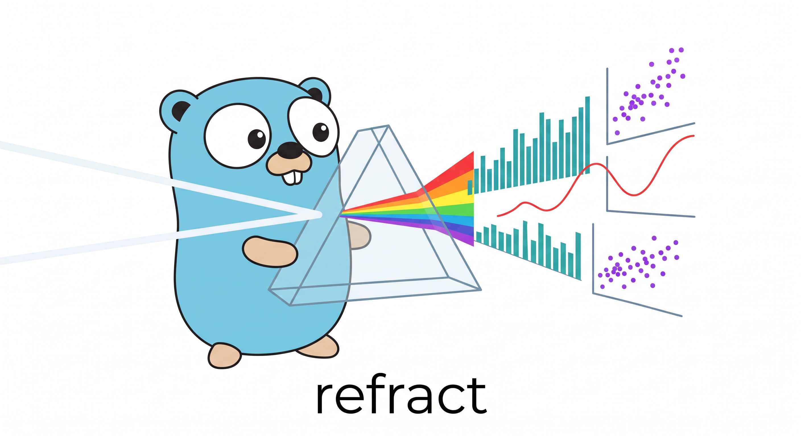
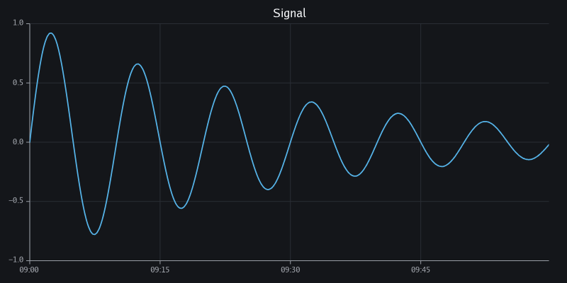
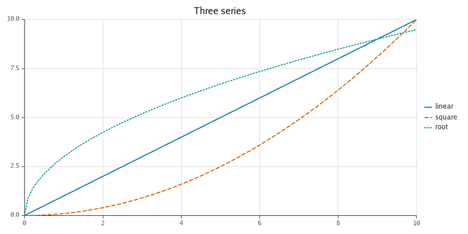
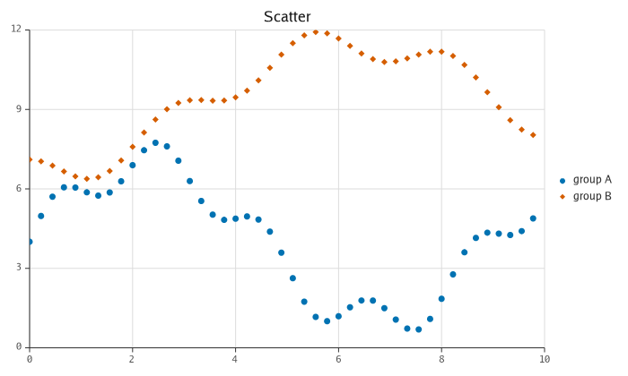
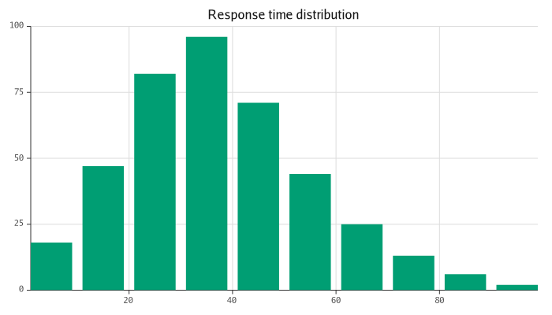

<p align="center">
  
</p>

# refract

[](https://github.com/timzifer/refract/actions/workflows/ci.yml)
[](https://github.com/timzifer/refract/actions/workflows/ci.yml)
[](https://pkg.go.dev/github.com/timzifer/refract)
[](LICENSE)

**A grammar-driven plotting library for Go: one model, many backends, runs
everywhere — built on the GoGPU stack.**

> **Status: pre-alpha.** This is milestone **v0.1**, "it plots". The API is not
> stable; every release below `v1.0.0` may contain breaking changes without a
> deprecation cycle. See [CONCEPT.md](CONCEPT.md) for the design and the road
> ahead.

The name is the thesis: one beam enters a prism, a spectrum comes out. One chart
specification enters refract, a spectrum of output formats comes out.



---

## What it is

One declarative chart specification, rendered through interchangeable backends.
The core is **pure Go with no dependencies at all** — not "no cgo", literally
nothing outside the standard library — and emits SVG. Add one module and the
same specification renders to PNG and JPEG through
[`gogpu/gg`](https://github.com/gogpu/gg), still with `CGO_ENABLED=0`.

| | Dependencies | Output |
|---|---|---|
| `github.com/timzifer/refract` | **stdlib only** | SVG |
| `github.com/timzifer/refract/backend/gg` | GoGPU (`gg`), `x/image` — zero CGO | PNG, JPEG |

Raster, PDF, GPU, browser and interactive rendering all live behind the same
`ir.Backend` interface. v0.1 ships the first two; the rest are milestones, not
architecture changes.

## Install

```sh
go get github.com/timzifer/refract               # core: SVG, stdlib only
go get github.com/timzifer/refract/backend/gg    # raster: PNG and JPEG
```

Go 1.25 or newer ([why](docs/adr/0005-go-version.md)).

## Quick start

```go
package main

import (
	"log"
	"math"

	"github.com/timzifer/refract"
	"github.com/timzifer/refract/geom"
	"github.com/timzifer/refract/palette"
	"github.com/timzifer/refract/scale"
	"github.com/timzifer/refract/theme"
)

func main() {
	xs := make([]float64, 200)
	ys := make([]float64, 200)
	for i := range xs {
		xs[i] = float64(i) / 20
		ys[i] = math.Sin(xs[i])
	}

	p := refract.New(
		refract.Theme(theme.Dark),
		refract.Size(800, 400),
		refract.Title("Signal"),
		refract.YTitle("amplitude"),
	)
	p.X(scale.Linear(scale.Nice()))
	p.Y(scale.Linear(scale.Nice()))
	p.Add(geom.Line(
		refract.Float64Columns(map[string][]float64{"x": xs, "y": ys}),
		geom.X("x"), geom.Y("y"),
		geom.Color(palette.Blue),
		geom.Tension(0.4),
	))

	if err := p.Render(refract.SVG("signal.svg")); err != nil {
		log.Fatal(err)
	}
}
```

For raster, swap the target — nothing else changes:

```go
import ggbackend "github.com/timzifer/refract/backend/gg"

err := p.Render(ggbackend.PNG("signal.png"))
```

A runnable version is in [`examples/signal`](examples/signal).

## Gallery

Every figure below is rendered by
[`backend/gg/cmd/gallery`](backend/gg/cmd/gallery) and re-checked in CI, so a
picture here cannot drift away from the code that produced it.

| | |
|---|---|
|  |  |
|  |  |

## What v0.1 does

- **Scales** — linear and time. Linear tick placement uses
  [extended Wilkinson](https://rdrr.io/rforge/labeling/man/extended.html)
  (Talbot, Lin & Hanrahan 2010), so axis labels come out round rather than
  merely evenly spaced. Time ticks step in calendar units.
- **Geoms** — `Line` (optionally tension-smoothed, with an explicit
  gap/interpolate/error policy for missing data), `Scatter` (six marker
  shapes), `Bar`.
- **Chart furniture** — axes, grid, tick labels with collision avoidance, chart
  and axis titles, a legend.
- **Themes** — light and dark, with a colourblind-safe
  ([Okabe-Ito](https://jfly.uni-koeln.de/color/)) default palette.
- **Data** — columnar and batch-oriented. A `[]float64`-backed source is
  borrowed, never copied.
- **Backends** — the built-in SVG emitter, and the gg raster adapter.

Deliberately **not** in v0.1: faceting, constraint layout, PDF, log and ordinal
scales, decimation, Arrow, the JSON spec, interactivity, GPU, browser. Each is a
later milestone in [CONCEPT.md §14](CONCEPT.md#14-roadmap--milestones).

## How it fits together

```
   Your spec  ──►  Model  ──►  IR  ──►  Backend  ──►  output
   ─────────      ─────      ────      ───────       ──────
   geoms          scales     ~8        backend/svg    SVG
   scales         layout     drawing   backend/gg     PNG / JPEG
   theme          ticks      ops       (future)       PDF, GPU, browser
```

The `ir.Backend` interface is the seam. Geoms never touch a renderer; a renderer
never knows what a scale is. That is what lets refract stand on a young,
fast-moving graphics stack without being welded to it — the whole gg adapter is
about 300 lines ([why that matters](docs/adr/0006-gg-coupling-surface.md)).

## Documentation

- [CONCEPT.md](CONCEPT.md) — the design document: motivation, positioning,
  architecture, roadmap.
- [docs/adr](docs/adr) — why the open questions were answered the way they were.
- [CONTRIBUTING.md](CONTRIBUTING.md) — building a two-module repository, and how
  to regenerate golden files and figures.

## License

MIT. The core links nothing; `backend/gg` links only permissively licensed code
(gg is MIT, `x/image` is BSD-3-Clause). That is a requirement rather than a
preference — refract must be embeddable by downstream projects under any
license.
