<p align="center">
  
</p>

# refract

[](https://github.com/timzifer/refract/actions/workflows/ci.yml)
[](https://github.com/timzifer/refract/actions/workflows/ci.yml)
[](https://pkg.go.dev/github.com/timzifer/refract)
[](LICENSE)

**A grammar-driven plotting library for Go: one model, many backends, runs
everywhere — built on the GoGPU stack.**

> **Status: v1.6.0, released.** Every milestone through **v1.0** has shipped,
> and the [v1 API audit](docs/v1-api-audit.md) is in: what it asked to change
> before the freeze has changed. The API was frozen at the `v1.0.0` tag and
> follows semver from here, so a breaking change means a major version and a
> deprecation cycle precedes it. Three milestones landed after `v1.2.0` and its
> `coord.Smith`, and each is additive: `v1.3.0`, the six gaps that were not
> chart types — a null that is a missing value in a text or temporal column, a
> tick format and a language a *document* can choose, an interval mark, a
> second axis in either direction, and a PDF that carries the font its labels
> need; `v1.4.0`, **bucket E, the last one in the catalogue**: `geom.Treemap`,
> `geom.Icicle`, `geom.Sankey` and `geom.Arc`, which are also a sunburst and a
> chord diagram once the coordinate stage has had them
> ([ADR 0039](docs/adr/0039-relational-layouts.md)); `v1.5.0`, two
> diagnostics — `geom.AvoidOverlap` for panel-local label placement
> ([ADR 0040](docs/adr/0040-label-collision-avoidance.md)) and `geom.QQ` for
> normal quantile-quantile plots ([ADR 0041](docs/adr/0041-qq-plots.md)); and
> `v1.6.0`, colour ramps that compress their domain (`scale.ColorLog`) or cut
> it into classes (`scale.Threshold`, `scale.Quantize`, `scale.Quantile`),
> which is what a heatmap over counts spanning orders of magnitude needed
> ([ADR 0042](docs/adr/0042-colour-transforms-and-classes.md)).
> `v1.3.0` and `v1.4.0` tag the core alone; the nested modules are tagged at
> `v1.5.0` and `v1.6.0` with it: `backend/gg` and `backend/window` share the
> core's version, the opt-in GPU tier is at `v0.3.0`, and the Arrow adapter at
> `arrow/v18.0.4`, whose major is Arrow's. See [CONCEPT.md](CONCEPT.md) for the design and the
> road ahead.

The name is the thesis: one beam enters a prism, a spectrum comes out. One chart
specification enters refract, a spectrum of output formats comes out.


---

## What it is

One declarative chart specification, rendered through interchangeable backends.
The core is **pure Go with no dependencies at all** — not "no cgo", literally
nothing outside the standard library — and emits both vector formats, SVG and
PDF. Add one module and the same specification renders to PNG and JPEG through
[`gogpu/gg`](https://github.com/gogpu/gg), still with `CGO_ENABLED=0`.

| | Dependencies | Output |
|---|---|---|
| `github.com/timzifer/refract` | **stdlib only** | SVG, PDF, browser canvas |
| `github.com/timzifer/refract/backend/gg` | GoGPU (`gg`), `x/image` — zero CGO | PNG, JPEG, an in-memory surface |
| `github.com/timzifer/refract/backend/window` | GoGPU (`gogpu`, `gg`) — zero CGO | a native window |
| `github.com/timzifer/refract/backend/gg/gpu` | GoGPU (`gg/gpu`, `wgpu`) — zero CGO | — (switches the GPU tier on) |
| `github.com/timzifer/refract/arrow/v18` | `apache/arrow-go` — zero CGO | — (a data source) |

The browser is in the core too, because it needs nothing to be: a canvas 2D
context is reached through `syscall/js`, which is the standard library
([ADR 0017](docs/adr/0017-browser-backend.md)). Everything else is behind the
same `ir.Backend` interface, in a module of its own, so what a program links is
what it asked for: a server that renders SVG links nothing but the standard
library, and a desktop program that opens a window links a window layer.

## Install

The release check in [CONTRIBUTING.md](CONTRIBUTING.md#releasing) verifies each
module outside the development workspace before it is tagged, so a published
`require` line names a core that exists.

```sh
go get github.com/timzifer/refract                  # core: SVG and PDF, stdlib only
go get github.com/timzifer/refract/backend/gg       # raster: PNG and JPEG
go get github.com/timzifer/refract/backend/window   # a native window
go get github.com/timzifer/refract/backend/gg/gpu   # optional: the GPU tier
go get github.com/timzifer/refract/arrow/v18        # optional: plot Arrow data
```

Go 1.25 or newer ([why](docs/adr/0005-go-version.md)).

## Quick start

```go
package main

import (
	"log"
	"math"

	"github.com/timzifer/refract"
	"github.com/timzifer/refract/geom"
	"github.com/timzifer/refract/palette"
	"github.com/timzifer/refract/scale"
	"github.com/timzifer/refract/theme"
)

func main() {
	xs := make([]float64, 200)
	ys := make([]float64, 200)
	for i := range xs {
		xs[i] = float64(i) / 20
		ys[i] = math.Sin(xs[i])
	}

	p := refract.New(
		refract.Theme(theme.Dark),
		refract.Size(800, 400),
		refract.Title("Signal"),
		refract.YTitle("amplitude"),
	)
	p.X(scale.Linear(scale.Nice()))
	p.Y(scale.Linear(scale.Nice()))
	p.Add(geom.Line(
		refract.Float64Columns(map[string][]float64{"x": xs, "y": ys}),
		geom.X("x"), geom.Y("y"),
		geom.Color(palette.Blue),
		geom.Tension(0.4),
	))

	if err := p.Render(refract.SVG("signal.svg")); err != nil {
		log.Fatal(err)
	}
}
```

For PDF or raster, swap the target — nothing else changes:

```go
err := p.Render(refract.PDF("signal.pdf"))          // still stdlib only

import ggbackend "github.com/timzifer/refract/backend/gg"
err := p.Render(ggbackend.PNG("signal.png"))
```

A runnable version is in [`examples/signal`](examples/signal).

## Gallery

Every figure below is rendered by
[`backend/gg/cmd/gallery`](backend/gg/cmd/gallery) and re-checked in CI, so a
picture here cannot drift away from the code that produced it.

| | |
|---|---|
|  |  |
|  |  |
|  |  |
|  |  |
|  |  |
|  |  |
|  |  |
| 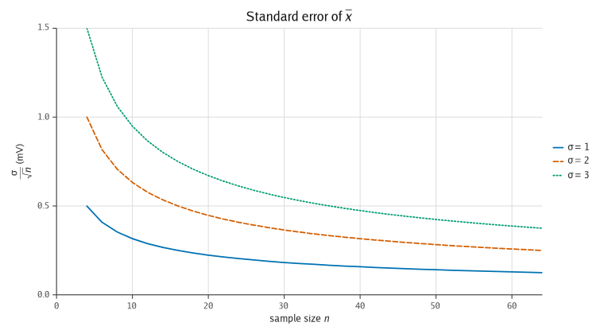 | 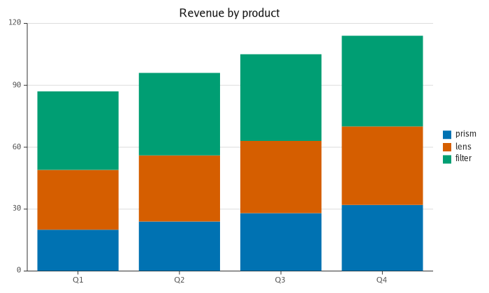 |
| 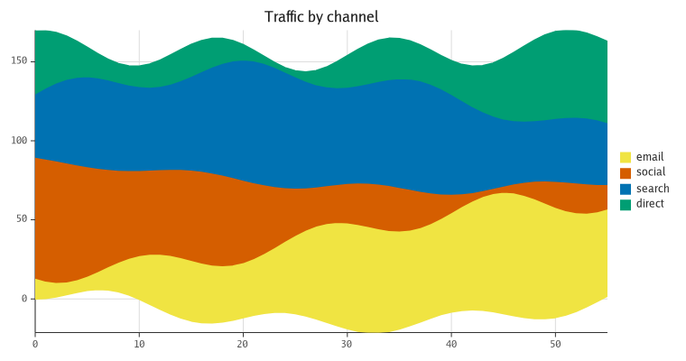 | 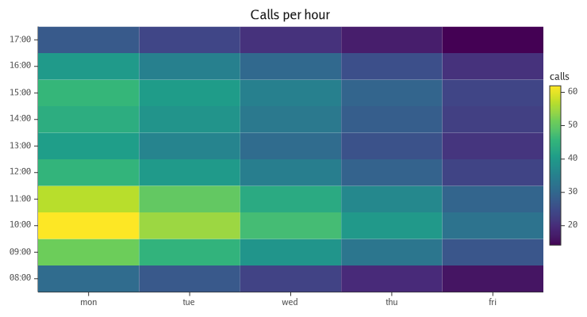 |
| 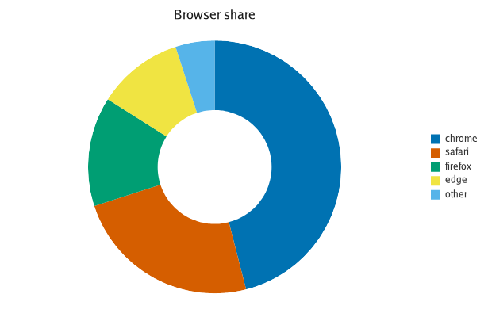 | 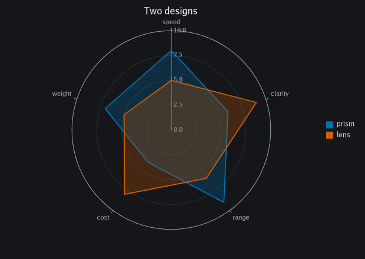 |
| 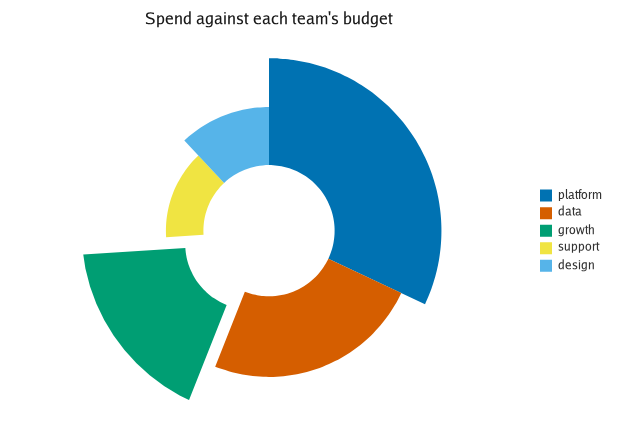 | 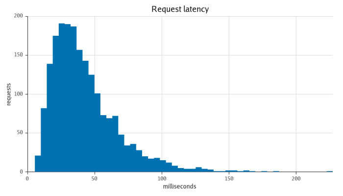 |
|  | 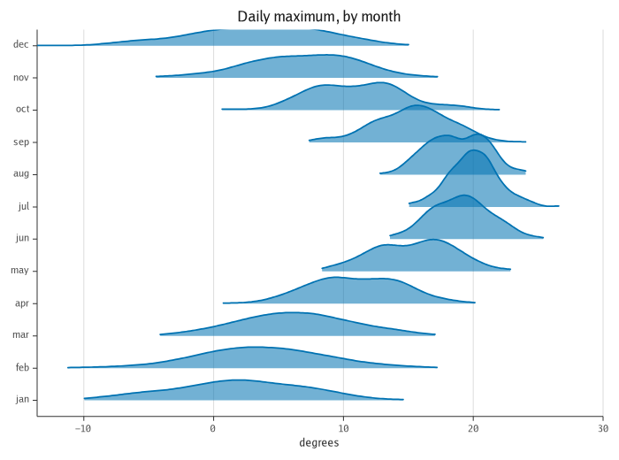 |
|  | 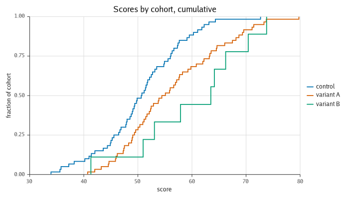 |
| 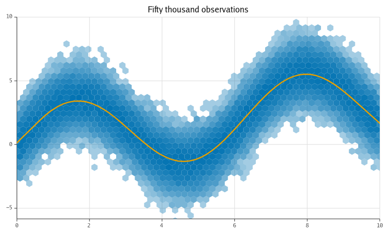 | 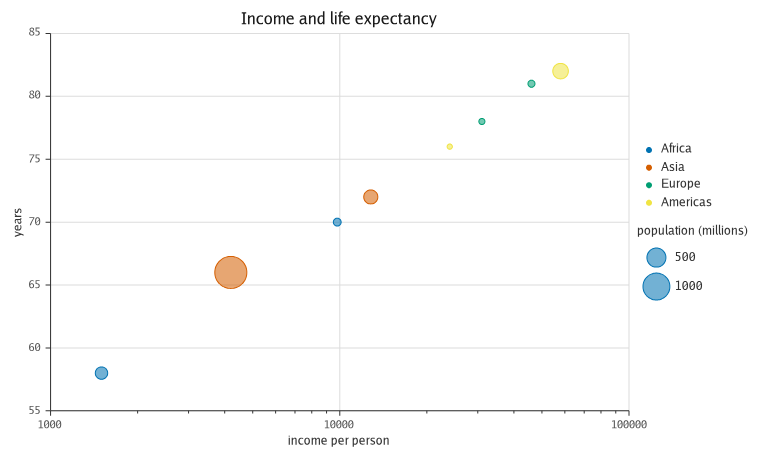 |
| 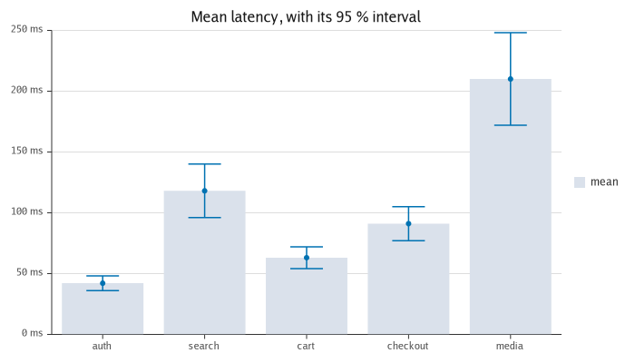 | 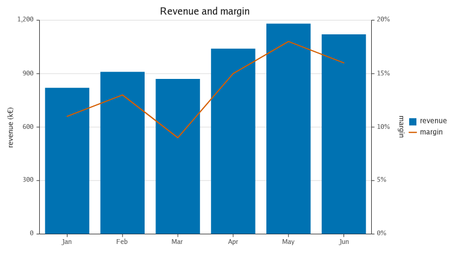 |
|  |  |
| 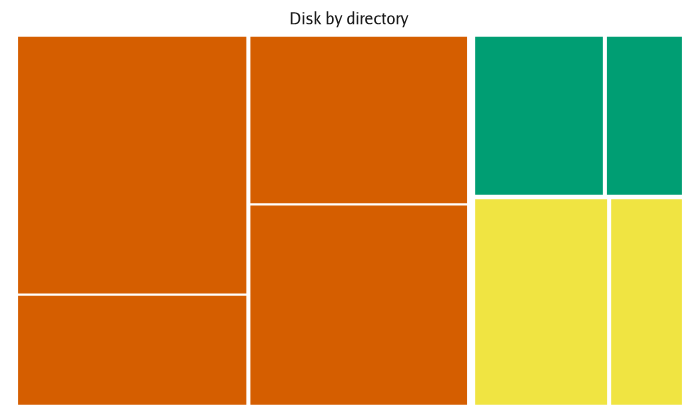 | 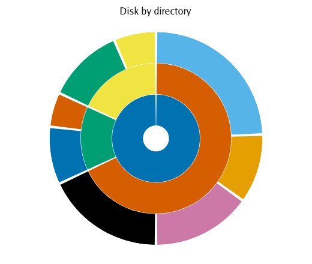 |
| 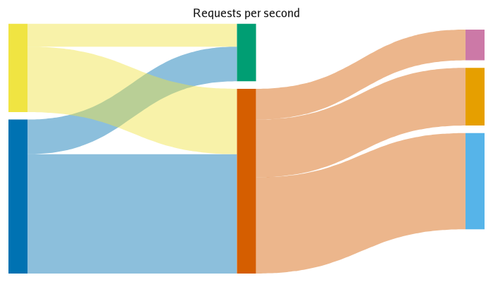 | 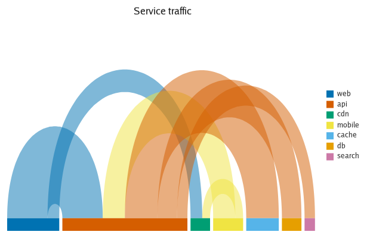 |
| 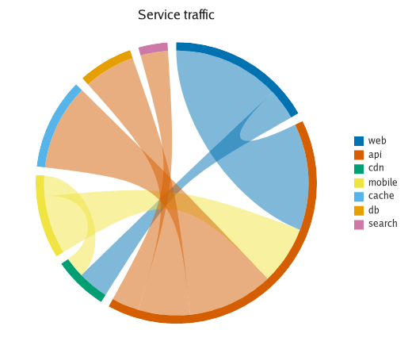 | |

## What it does

- **Scales** — linear, time, **log**, **symlog** and **ordinal/categorical**.
  Linear tick placement uses
  [extended Wilkinson](https://rdrr.io/rforge/labeling/man/extended.html)
  (Talbot, Lin & Hanrahan 2010), so axis labels come out round rather than
  merely evenly spaced. Time ticks step in calendar units. Log and symlog
  subdivide each decade with unlabelled minor ticks; symlog is linear near zero,
  so signed data spanning orders of magnitude is plottable at all.
  `scale.TickValues` pins the sequence outright, for an axis whose ticks are a
  convention rather than a reading — the 0.2 / 0.5 / 1 / 2 / 5 of a Smith chart,
  the five points of a Likert item.
- **Geoms** — `Line` (optionally tension-smoothed), `Scatter` (six marker
  shapes), `Bar`, **`Area`** (to a baseline, or a band between two series),
  **`Step`** (pre/mid/post), **`Boxplot`** (Tukey whiskers, type-7 quartiles,
  outliers), and **`Rect`** — one box per row, bounded by the row rather than by
  a baseline, which is what a heatmap, a gantt bar, a candle and a waterfall
  step all are.
- **Distribution marks** — **`Histogram`**, **`Violin`**, **`Ridgeline`**,
  **`Hexbin`**, **`Beeswarm`**, **`ECDF`** and **`Trend`**. Each is a pure
  function in [`stat/`](stat) — a 1-D binner, a Gaussian KDE with Silverman's
  bandwidth rule, a hexagonal lattice, an empirical CDF, locally weighted
  regression — with a determinism test, drawn by a mark that trains its axis on
  the summary rather than on the rows
  ([ADR 0028](docs/adr/0028-distribution-stats.md)).
- **Relational and hierarchical marks** — **`Treemap`**, **`Icicle`**,
  **`Sankey`** and **`Arc`**, which read an edge table rather than a pair of
  axes: `geom.From`/`geom.To` for a flow, `geom.ID`/`geom.Parent` for a
  hierarchy, and `geom.Value` for the magnitude of either. Each places its own
  layout in the unit square and hands it to the coordinate stage, so an
  `Icicle` under `coord.Polar` is a **sunburst** and an `Arc` under one is a
  **chord diagram** — four marks, six charts, and no second implementation of
  anything ([ADR 0039](docs/adr/0039-relational-layouts.md)).
- **Series in one layer** — `geom.GroupBy` splits a long table into N series
  drawn by one layer, each with its own colour and its own legend entry.
- **Position adjustments** — `geom.Stack` (from zero, to 100 %, about a
  silhouette, or with the streamgraph's wiggle) and `geom.Dodge` (side by side).
  The offsets are derived while the scales are trained, so a stacked axis
  reaches the total rather than the tallest single value
  ([ADR 0019](docs/adr/0019-position-adjustments.md)).
- **Colour** — a qualitative palette per chart, plus **colour scales** bound to
  a column by `geom.ColorBy`: a sequential or diverging ramp for a quantity, or
  `scale.Qualitative` for categories. Which guide the layer contributes follows
  from which it was handed — a ramp gets a colourbar, a palette gets one legend
  entry per category
  ([ADR 0020](docs/adr/0020-discrete-colour-and-multi-entry-legends.md)).
  Ramps interpolate in linear light, so a gradient has no dark band through its
  middle. A ramp can run logarithmically across its domain (`scale.ColorLog`,
  `scale.ColorSymLog`) — without it a heatmap over counts spanning orders of
  magnitude rounds every cell but the densest few to one end — or be cut into
  classes so that a colour names an interval rather than a shade to estimate:
  `scale.Threshold` for boundaries that come from outside the data,
  `scale.Quantize` for equal ones, `scale.Quantile` for equally many
  observations in each. A classed scale's colourbar is drawn in bands and
  labelled at the boundaries.
- **Coordinate systems** — `coord.Cartesian` is the identity and the default;
  `coord.Polar` wraps one axis around a circle and reads the other as a radius,
  which turns the marks that already exist into pie, donut, radar, rose, wind
  rose and gauge. A scale still maps a value into an interval — the coord
  decides what the interval means — so no geom and no scale changed shape for
  it, and the arcs are cubics because the IR has always had those
  ([ADR 0018](docs/adr/0018-coordinate-systems.md)). A slice's inner and outer
  radius are columns like its share is (`geom.X` and `geom.X2`), and
  `geom.ExplodeBy` breaks one out of the ring without changing what it says
  ([ADR 0026](docs/adr/0026-breaking-a-mark-out.md)). **`coord.Smith`** is the
  third one: it reads the pair as a complex impedance and maps it through
  Γ = (z−1)/(z+1) onto the unit disc, which is the chart every RF engineer works
  on and almost no plotting library draws. Its grid is the two axes' own ticks —
  constant-resistance circles from X, constant-reactance arcs from Y — so
  `render` was not touched for it
  ([ADR 0033](docs/adr/0033-smith-charts.md)).
- **Size** — `geom.SizeBy` reads a column through `scale.Size`: the bubble
  chart. The mapping is by **area**, not radius, so doubling a value multiplies
  the diameter by √2 and two bubbles compare the way a reader already reads
  them. The layer contributes a third guide kind — a ladder of sample marks —
  beside the legend and the colourbar
  ([ADR 0027](docs/adr/0027-size-channel-and-the-guide-column.md)).
- **Missing data** — one explicit policy per layer (gap, interpolate, error),
  covering both `NaN`/`Inf` and values a scale has no position for, such as zero
  on a log axis.
- **Annotations** — `HLine`, `VLine`, `HBand`, `VBand`, `Segment`, `Region` and
  `Note`. They take values rather than a data source, because there is no column
  behind "the SLO is 200ms", and they extend the axis so the threshold is in
  view even when the data is nowhere near it.
- **Small multiples and subplots** — `facet.Wrap` and `facet.Grid` split one
  plot by a column; `refract.NewGrid` puts different plots on one canvas. Both
  go through one constraint solver, so panels are the same size and their axes
  line up ([ADR 0010](docs/adr/0010-panel-layout.md)).
- **Chart furniture** — axes, grid, tick labels with collision avoidance, chart
  and axis titles, and one guide column carrying a legend, **colourbars** and
  **size keys**, stacked in that order and measured by one solver.
- **Themes** — light and dark, built from a dozen
  [tokens](theme/tokens.go) rather than fifty fields, with a colourblind-safe
  ([Okabe-Ito](https://jfly.uni-koeln.de/color/)) default palette and
  perceptually uniform sequential ramps (Viridis, Cividis, Magma). `Theme.With`
  edits one; `theme.Register` and `theme.ByName` resolve one from a config file.
- **Big data** — a layer with more rows than the plot has pixels reduces itself
  before it draws: `stat.LTTB` for a line, min/max per pixel column for a
  staircase or a band, density binning to an image for a point cloud, or a
  `geom.Hexbin` when the counts themselves are the answer. It happens
  when the chart is drawn, never when the scales are trained, so the axes still
  report the data rather than the subset that survived
  ([ADR 0011](docs/adr/0011-decimation.md)).
- **Parallel panels** — a facet or a grid builds its panels on separate
  goroutines and replays them in panel order, so the output is byte-identical to
  a serial render ([ADR 0012](docs/adr/0012-parallel-panels.md)).
- **Data** — columnar and batch-oriented, carrying numeric, time and categorical
  columns. A `[]float64`-backed source is borrowed, never copied, and so is a
  null-free `float64` column read straight out of an **Apache Arrow** record
  through the optional `refract/arrow/v18` module.
- **Interaction** — `Plot.On` registers handlers for hover, click, zoom and
  pan; `Plot.Live` draws into a surface that can be redrawn; `refract.Input` is
  the state machine that turns raw pointer input into those, and `Live.Bind`
  drives it from a DOM element. Hit-testing runs over the marks a render emitted
  rather than over a second copy of every geom's projection, and
  `Live.TrackRows` makes a hit name the source row behind the mark
  ([ADR 0015](docs/adr/0015-hit-testing.md)).
- **Live data** — `data.Stream` is appended to from any goroutine and frozen
  between frames, and a redraw repaints only what changed
  ([ADR 0016](docs/adr/0016-streaming-and-damage.md)).
- **A chart as JSON** — a `*Plot` marshals to a Vega-Lite-shaped document and
  reads back as the same chart ([ADR 0014](docs/adr/0014-json-spec.md)).
- **Accessibility** — a chart's title becomes an SVG `<title>` with
  `role="img"`, a PDF document title and a canvas `aria-label`; `Plot.Describe`
  writes the `<desc>` a screen reader announces after it; `Plot.DataTable`
  writes the rows as an HTML table; and `theme.Redundant` tells layers apart by
  dash and shape as well as by colour
  ([ADR 0024](docs/adr/0024-accessibility.md)).
- **Notation in labels** — optional and pluggable, with a TeX subset built in.
  A label is measured as it will be drawn, in every place a chart writes one
  ([ADR 0023](docs/adr/0023-math-typesetting.md)).
- **Responsive charts** — `refract.Responsive` scales a theme with the size the
  chart is drawn at, and `Live.Resize` is how a surface says its size changed
  ([ADR 0025](docs/adr/0025-responsive-charts.md)).
- **Backends** — three built-in emitters — SVG, PDF and a browser canvas — the
  gg raster adapter, a native window, and an opt-in GPU tier.

- **Identity and transitions** — `geom.KeyBy` names the column that says which
  row is which, so a hover in one chart can be acted on in another, and two
  states of a table can be blended into a movement between them. The blend is
  in data space, before the scales, and refract owns no clock: `At(f)` is the
  whole primitive ([ADR 0043](docs/adr/0043-mark-identity.md),
  [ADR 0044](docs/adr/0044-transitions.md)).

- **An overlay the chart owns** — `refract.Crosshair`, `Highlight`, `Brush` and
  `Tooltip` paint over the finished chart, after the guides and clipped by
  nothing. What an overlay draws is not hit-testable, because a tooltip a
  pointer can hit is a tooltip that flickers
  ([ADR 0046](docs/adr/0046-overlay-layer.md)).
- **Guides you can click** — a hit on a legend row reports which series it
  stands for, and `Live.Toggle` puts that series away and brings it back; the
  row stays, dimmed, and the axes do not move
  ([ADR 0047](docs/adr/0047-clickable-legend.md)). A colourbar and a size key
  report a *quantity* instead, because neither is a series: a classed band
  gives the interval it covers, a continuous ramp the value under the pointer
  ([ADR 0048](docs/adr/0048-clickable-colourbar-and-size-key.md)).

Deliberately **not** here: geographic projections, node-link and Venn diagrams,
contour plots, 3D, and any engine that links two charts together — a link is a
statement about two charts and this model is about one, so the host is the link
([ADR 0045](docs/adr/0045-linked-views.md)). The rest are past v1.0 in
[CONCEPT.md §14](CONCEPT.md#14-roadmap--milestones), and
[docs/chart-types.md](docs/chart-types.md) says what each one would need.

## Categories, distributions and orders of magnitude

```go
src := refract.NewTable().
    String("region", []string{"north", "south", "east", "west"}).
    Float64("sales", []float64{18, 42, 31, 25})

p := refract.New(refract.Size(700, 400), refract.Title("Sales by region"))
p.X(scale.Ordinal())                        // equal slots, one per category
p.Y(scale.Linear(scale.Nice(), scale.Zero()))
p.Add(geom.Bar(src,
    geom.X("region"), geom.Y("sales"),
    geom.ColorBy("sales", scale.Sequential(palette.Viridis)),
))
```

An ordinal axis is a *band* scale: it tells the bar how wide to be, rather than
the bar guessing from the spacing of the data. The same applies to
`geom.Boxplot`. For data that spans decades, swap in `scale.Log(scale.LogNice())`
— or `scale.SymLog()` when it also crosses zero.

A runnable version, together with a boxplot over the same kind of data, is in
[`examples/categories`](examples/categories).

## Series in one layer, stacked or side by side

A table with a series column is *one* layer, not N. `geom.GroupBy` splits it,
and the position adjustments are defined over the groups it makes:

```go
// quarter, product, revenue — twelve rows, one per (quarter, product) pair
p.X(scale.Ordinal())
p.Y(scale.Linear(scale.Nice(), scale.Zero()))
p.Add(geom.Bar(src,
    geom.X("quarter"), geom.Y("revenue"),
    geom.GroupBy("product"),
    geom.ColorBy("product", scale.Qualitative(palette.OkabeIto)),
))
```

A grouped bar stacks from the baseline up, because that is what a bar chart
with a series column means. `geom.Dodge(0.1)` puts the products side by side
instead, `geom.Stack(geom.StackFill)` makes it a 100 % chart, and
`geom.Stack(geom.StackWiggle)` over `geom.Area` is a streamgraph. The axis is
trained on what will be drawn rather than on the column, so a stacked axis
reaches the total; each segment is its own shape, so a pointer lands on the
segment and `Live.TrackRows` names the row behind it.

The legend names every series. One swatch per layer could not, which is why a
layer contributes as many entries as it has to
([ADR 0020](docs/adr/0020-discrete-colour-and-multi-entry-legends.md)).

## A pie is a stacked bar in a different coordinate system

A scale maps a value into an interval; a **coord** decides what that interval
means. `coord.Cartesian` — the default — says it is a distance along an edge of
the plot. `coord.Polar` says one of the two intervals is an angle and the other
a radius, and the marks that were already there draw the family that was
missing:

```go
p := refract.New(
    refract.Coord(coord.Polar(coord.Theta(coord.FromY), coord.Hole(0.45))),
    refract.Theme(theme.Light.With(
        theme.Grid(false, false), theme.AxisLines(false, false), theme.Ticks(false, false))),
)
p.X(scale.Linear())          // one slot, filling the radius
p.Y(scale.Linear())          // the stacked total, filling the circle
p.Add(geom.Bar(src, geom.X("all"), geom.Y("share"),
    geom.GroupBy("browser"),
    geom.ColorBy("browser", scale.Qualitative(palette.OkabeIto))))
```

That is the whole of the donut above: the same `geom.Bar` layer that draws a
stacked bar chart in Cartesian, with θ taken from the Y axis instead. The ring
closes into a full circle because a stacked domain ends at the total — which is
why neither scale is niced — and the hole is where the radial scale starts, so
it is an annulus rather than a circle of background painted over the middle.

### A slice's radii are dimensions, and a slice can leave the ring

The donut above carries one number per slice: its share, which is the angle.
Two more are already there for the taking, because the radial axis is an axis
like any other. `geom.X` and `geom.X2` name a mark's two edges on it — the pair
a gantt bar has used since v0.7 — so a slice starts and stops where its row
says:

```go
p := refract.New(refract.Coord(coord.Pie(coord.Radius(0.95))), refract.Theme(bare))
p.X(scale.Linear(scale.Domain(0, 1)))   // the radius: 1 is the whole budget
p.Y(scale.Linear())                     // the angle: the stacked share
p.Add(geom.Bar(src,
    geom.X("floor"), geom.X2("used"),   // where the slice starts and stops
    geom.Y("share"),                    // how far round it goes
    geom.GroupBy("team"),
    geom.ExplodeBy("pull"),             // and which of them leaves the ring
    geom.ColorBy("team", scale.Qualitative(palette.OkabeIto))))
```

That is the figure above: three numbers per slice, one layer, no new mark.
`coord.Pie()` and `coord.Donut(f)` are sugar for the polar recipe and describe
themselves as the polar coord they are.

`geom.Explode(f)` breaks every mark of a layer out of the middle by a fraction
of the outer radius; `geom.ExplodeBy(col)` reads that fraction per row, which is
what pulls one slice out and leaves the rest where they were. It is a
displacement rather than a longer radius, and that is the whole point: the slice
still says what it said, the gap shows where it came from, and a pointer follows
it out — the path a geom hands the backend is the path that gets indexed, so a
hit in the gap finds nothing. A coord with no middle to move away from —
`coord.Cartesian` — ignores it rather than inventing a direction, which is why
every golden file in the repository is unchanged by an option every geom now
accepts ([ADR 0026](docs/adr/0026-breaking-a-mark-out.md)).

A radar is `geom.Line` or `geom.Area` over an ordinal angular axis, with
`coord.Chord()` for sides that are straight and `geom.Closed(true)` for a
contour that comes back to the first axis. A rose, a wind rose and a gauge are
bars; a polar boxplot is a boxplot. None of them is a new geom, which is the
point of having a stage rather than a shape
([ADR 0018](docs/adr/0018-coordinate-systems.md)).

The stage costs an existing chart nothing: `Cartesian` is the identity, and
every golden file and every figure in this README is unchanged by it. What it
does change is what a pointer can be told — a hit is inverted back through the
coord before the scales see it, so a pointer over a slice reports the value the
slice stands for rather than a pixel, and `Live.TrackRows` names the row.
Concentric rings replace horizontal grid lines and the tick labels go round the
outside; the coord reports that geometry and `render` still strokes it, because
`render` is the only package that knows the drawing order of a chart.

Decimation is deliberately off under a polar coord. `stat.LTTB` buckets by pixel
column and a bucket of equal angle is not a bucket of equal width, so the coord
reports that it does not decimate rather than have a reduction measure something
it was not designed for. Nothing polar is a big-data chart, so this costs
nothing real.

A runnable version of the donut, the radar, a wind rose, a gauge and the
broken-out donut above is in [`examples/polar`](examples/polar).

## A Smith chart is a coordinate system too

Almost no general-purpose plotting library draws a Smith chart, because a Smith
chart is not a mark. It is a conformal map of the impedance half-plane onto the
unit disc — Γ = (z−1)/(z+1) — and a library whose coordinate stage is hard-coded
Cartesian cannot express it at any price. `refract`'s stage can, and `coord.Smith`
is the third one:

```go
p := refract.New(refract.Coord(coord.Smith()))

// The two columns are the normalised impedance: r = R/Z₀ and x = X/Z₀.
// TickValues asks for the grid a paper chart is printed at — six values every
// RF engineer expects in those places, which no tick-choosing algorithm
// produces because they are not evenly spaced and are not meant to be.
p.X(scale.Linear(scale.Domain(0, 50), scale.TickValues(0, 0.2, 0.5, 1, 2, 5)))
p.Y(scale.Linear(scale.Domain(-50, 50),
    scale.TickValues(-5, -2, -1, -0.5, -0.2, 0.2, 0.5, 1, 2, 5)))

p.Add(geom.Line(sweep, geom.X("r"), geom.Y("x")))
```


There is no Smith geom and no Smith mark: that is a `geom.Line` from v0.1. And
there is nothing drawing the grid, either — the constant-resistance circles are
what the X ticks look like once the coord has had them, and the
constant-reactance arcs are the Y ticks, so `render` draws this with the same two
loops it draws a Cartesian grid with. Not one line of `render/` changed for it;
see [ADR 0033](docs/adr/0033-smith-charts.md), which argues why this is the same
seam polar is and not the wider one a map projection needs.

An instrument reports S₁₁ as a reflection coefficient rather than as an
impedance, so a measured sweep is one line at the call site:

```go
r[i], x[i] = coord.SmithZ(re[i], im[i])   // z = (1+Γ)/(1−Γ)
```

Three more things are worth knowing. **Both axes are linear**, and the domains
are pinned rather than trained: the chart's extent is the whole disc whatever
the data does, and a near-open reflection is a resistance in the thousands that
would otherwise drag every tick into the last pixel before the rim. **An edge is
a chord by default**, because a line between two measured samples asserting a
linear sweep in impedance is an assertion the instrument did not make;
`coord.SmithArc` draws the exact image for a locus that genuinely is straight in
impedance, which is what a matching network's steps are. And
**`coord.SmithAdmittance`** turns the disc through half a turn and reads the pair
as a conductance and a susceptance — the Y chart a shunt element is read on, and
the same physical reflection in the same place, against the other grid.

Not drawn: constant-|Γ| circles, constant-Q arcs and a combined ZY overlay. Each
is a third grid family, and a coord may draw one grid line per tick a scale
emits — the same constraint that makes the columns an impedance in the first
place.

A runnable version of the sweep above, a two-element matching network and the
admittance chart is in [`examples/smith`](examples/smith).

## An edge table is a chart too

The last family of charts refract could not draw read neither a pair of axes nor
a summary of a column: they read a *relationship*. A treemap and a sunburst read
a hierarchy, `(id, parent, value)`; a sankey and a chord diagram read an edge
list, `(from, to, value)`. Both are ordinary columns, which is why `data.Source`
did not change to accommodate them.

```go
p := refract.New(refract.Size(700, 420), refract.Theme(bare))
p.X(scale.Linear())
p.Y(scale.Linear())
p.Add(geom.Treemap(src,
    geom.ID("path"), geom.Parent("under"), geom.Value("kb"),
    geom.Padding(0.006)))
```


Each mark lays its own geometry out in the unit square — a span across, a height
out — and hands it to the coordinate stage. Which means the polar half of this
family is not new drawing code at all. An icicle is a hierarchy's span across
and its depth out; wrapped round a circle, the root is at the middle and the
leaves are at the rim, and that is a **sunburst**:

```go
p := refract.New(refract.Size(520, 460), refract.Theme(bare),
    refract.Coord(coord.Polar(coord.Hole(0.12))))
p.X(scale.Linear())
p.Y(scale.Linear())
p.Add(geom.Icicle(src, geom.ID("path"), geom.Parent("under"), geom.Value("kb")))
```


It is `coord.Polar` and not `coord.Pie`, because a pie sweeps the *Y* axis round
the circle and this chart's Y is its depth.

A **sankey** reads the other shape. Nothing declares a node: a node exists
because a row mentioned it, it stands one column past the deepest source that
reaches it, and it is as thick as the greater of what enters and what leaves.

```go
p.Add(geom.Sankey(src, geom.From("from"), geom.To("to"), geom.Value("rps")))
```


And the same trick again: `geom.Arc` puts the nodes on a rail with the ribbons
rising off it, which is an arc diagram. Each band is as thick as what it
carries and arcs as high as it reaches, so the height reads as distance:

```go
p.Add(geom.Arc(src, geom.From("from"), geom.To("to"), geom.Value("rps")))
```


Move the rail to the rim and wrap it round a circle, and the ribbons cross the
middle — a **chord diagram**, from the same layer with one option and one coord
different.

```go
p := refract.New(refract.Size(520, 460), refract.Theme(bare),
    refract.Coord(coord.Polar()))
p.Add(geom.Arc(src, geom.From("from"), geom.To("to"), geom.Value("rps"),
    geom.Baseline(1)))
```


Four marks, six charts, and no second implementation of anything — the same
thing the coordinate stage bought for the pie, one bucket later. The layouts
themselves are pure functions in [`stat/`](stat), each with a determinism test:
node order comes from the order the rows first named them and never from a map,
and the sankey's relaxation runs a fixed number of sweeps rather than to
convergence, so a chart whose panels are built on several goroutines draws
exactly what a serial one draws
([ADR 0039](docs/adr/0039-relational-layouts.md)).

Both axes describe the unit square, which is nothing a reader needs to see — so
these charts want the same bare theme a pie does. A runnable version of all six
is in [`examples/relational`](examples/relational).

## Boxes bounded by their own row

`geom.Rect` occupies an arbitrary `[x0,x1] × [y0,y1]` per row — the mark a bar
is not, because a bar always touches the baseline. An edge no column names is
the slot the axis implies, so a heatmap is a rect and a ramp:

```go
p.X(scale.Ordinal(scale.OrdinalPadding(0)))
p.Y(scale.Ordinal(scale.OrdinalPadding(0)))
p.Add(geom.Rect(src, geom.X("day"), geom.Y("hour"),
    geom.ColorBy("calls", scale.Sequential(palette.Viridis))))
```

and a gantt bar, which knows where it starts and stops, names both:

```go
p.X(scale.Time())
p.Y(scale.Ordinal())
p.Add(geom.Rect(src, geom.X("from"), geom.X2("to"), geom.Y("task")))
```

Candlestick, waterfall, waffle and calendar are the same mark with different
columns — see [docs/chart-types.md](docs/chart-types.md).

A runnable version of all four charts is in [`examples/groups`](examples/groups).

## Distributions

Seven marks that summarise a column rather than plotting it. Each is a pure
function in [`stat/`](stat) with a determinism test, and each trains its axis on
the summary — a histogram's Y axis holds counts that appear nowhere in the
table, an ECDF's holds a fraction it computed
([ADR 0028](docs/adr/0028-distribution-stats.md)).

```go
p.Add(geom.Histogram(src, geom.X("latency")))              // bins chosen by Freedman–Diaconis
p.Add(geom.Histogram(src, geom.X("latency"), geom.Bins(40), geom.BinRange(0, 500)))
```

A violin draws the shape a boxplot summarises away, one per slot and — given a
series column — one per series within it:

```go
p.X(scale.Ordinal())
p.Add(geom.Violin(src, geom.X("service"), geom.Y("latency"), geom.GroupBy("region")))
```

A ridgeline is the same estimate laid out down a categorical axis, overlapping
on purpose: twenty little density panels are twenty comparisons a reader has to
carry between them, and twenty ridges are one picture.

```go
p.Y(scale.Ordinal())
p.Add(geom.Ridgeline(src, geom.X("temperature"), geom.Y("month"), geom.Overlap(2)))
```

A swarm shows every observation and hides none of them, deterministically — no
jitter, so the same data draws the same picture on every machine and every
frame. An ECDF shows a distribution with no parameter in it at all, and takes a
series column so several can be compared without overplotting:

```go
p.Add(geom.Beeswarm(src, geom.X("cohort"), geom.Y("score")))
p.Add(geom.ECDF(src, geom.X("score"), geom.GroupBy("cohort")))
```

A hexbin is the third answer to overplotting, beside decimation and the density
raster: a hexagon has six neighbours all the same distance away, so a cloud
binned into one grows none of the crosses and seams a square grid does.

```go
p.Add(geom.Hexbin(src, geom.X("x"), geom.Y("y"), geom.DensityCells(8)))
```

And a trend line goes on top of a scatter — locally weighted by default, so it
follows the data rather than assuming a shape:

```go
p.Add(
    geom.Scatter(src, geom.X("x"), geom.Y("y")),
    geom.Trend(src, geom.X("x"), geom.Y("y"), geom.Span(0.4)),
    geom.Trend(src, geom.X("x"), geom.Y("y"), geom.Smooth(geom.LinearFit)),
)
```

All seven, over samples that make the point, are in
[`examples/distributions`](examples/distributions).

## Bubbles: a third channel

`geom.SizeBy` gives every mark its size from a column. The scale maps by
**area** rather than by radius, because a reader compares two circles by how
much ink is in them — so a value twice another's is drawn with twice the ink and
√2 times the diameter, and the layer contributes a key of sample marks beside
the legend and the colourbar:

```go
p.Add(geom.Scatter(src,
    geom.X("gdp_per_capita"), geom.Y("life_expectancy"),
    geom.SizeBy("population", scale.Size()),
    geom.ColorBy("continent", scale.Qualitative(palette.OkabeIto)),
))
```

A sized layer draws circles rather than markers, and that is the IR's doing
rather than a preference: `ir.Backend.Markers` carries one style per drawing
call, so a per-row size would be a call per row. One path per colour with a
circle per subpath is one call per colour — and it gives a pointer the bubble it
is actually inside rather than the nearest centre
([ADR 0027](docs/adr/0027-size-channel-and-the-guide-column.md)).

The chart is in [`examples/distributions`](examples/distributions) too.

## Small multiples

```go
p := refract.New(refract.Size(900, 520), refract.Title("Throughput by region"))
p.Add(
    geom.Line(src, geom.X("hour"), geom.Y("rps"), geom.Label("throughput")),
    geom.HLine(60, geom.Label("target")),          // no data: drawn on every panel
)
p.Facet(facet.Wrap("region", facet.Columns(3)))
```

Panels share their scales by default, which is what makes small multiples
comparable at a glance. `facet.FreeX`, `facet.FreeY` and `facet.Free` give each
panel its own — a deliberate choice, because a reader who does not notice the
axes changed will read the panels as comparable when they are not.

For unrelated charts on one canvas, build a grid of plots instead:

```go
g := refract.NewGrid(2, refract.GridSize(900, 560), refract.GridTitle("Fleet"))
g.Add(latency, throughput, errors, saturation)
err := g.Render(refract.PDF("overview.pdf"))
```

A runnable version of both, with annotations and PDF output, is in
[`examples/dashboard`](examples/dashboard).

## A band at the edge, on the same axis

Some of what a chart shows is not on its other axis at all: a strip of machine
states under a speed trace, a rug of event times, a ribbon of shifts, a key or
a marginal distribution beside the panel. A track is a band at an edge of the
plot area that shares the axis it runs along and carries a scale of its own
across it — an ordinal one under a linear panel, which is the case it exists
for.

```go
p := refract.New(refract.Size(900, 480), refract.Title("Line 3"))
p.X(scale.Time()).Y(scale.Linear(scale.Zero()))
p.Add(geom.Line(speed, geom.X("t"), geom.Y("speed")))

p.Track(refract.Bottom, refract.TrackSize(48)).
    Add(geom.Rect(states, geom.X("start"), geom.X2("end"), geom.Y("state"),
        geom.ColorBy("state", scale.Qualitative(palette.Default))))
```

`refract.Bottom` and `refract.Top` are grid rows and share the plot's X;
`refract.Left` and `refract.Right` are grid columns and share its Y. Bands on
two edges at once are fine — the corner between them is simply empty.

The thickness comes out of the panel, not out of the panel's domain: the axis
the track does not share is identical with the track and without it, so
`scale.Zero()` still means what it says. The axis it *does* share is trained by
both, because it is one axis — a rug of event times widens the time axis to
cover the events, which is the reason to draw them against it.

The track and the panel hold the *same* scale object for that axis, so a zoom
is one zoom rather than two that agree, and a pointer over a state bar reports
its layer and its row like any other mark. Its lanes do not zoom, because half
a category is not a view of anything.

For the same shape across separate plots, stack them in a one-column grid on
one scale object — `refract.GridRowHeights(0, 48)` makes the second row a strip
and `refract.GridSharedX(true)` writes the time axis once, under the bottom
row, with `GridColWidths` and `GridSharedY` the same turned a quarter turn.
That path renders; interaction is what a track is for.

## A million rows

```go
p := refract.New(refract.Size(800, 500), refract.Title("A million samples"))
p.Add(geom.Line(src, geom.X("i"), geom.Y("v")))   // nothing else needed
```

That renders in about 60 ms into under 30 kB of SVG. Drawing every row takes six
times as long and produces 15 MB — of a picture that is 800 pixels wide, so the
extra 999,000 vertices land on top of each other.

The layer sees how many rows it has against how wide the plot is and reduces
itself accordingly: `LTTB` for a line, min/max per pixel column for a step or a
band, a density raster for a scatter dense enough that its markers would bury
one another. Override it per layer when the default is not what you want:

```go
geom.Line(src, geom.X("i"), geom.Y("v"), geom.Decimate(geom.MinMax))    // keep every spike
geom.Line(src, geom.X("i"), geom.Y("v"), geom.Decimate(geom.NoDecimation)) // every row
geom.Scatter(src, geom.X("x"), geom.Y("y"), geom.Budget(4000))          // at most 4000 marks
```

The reduction happens when the chart is drawn, not when its scales are trained,
so the axes are the data's either way — a spike survives the reduction *and* the
axis still reaches it.

The same milestone made a redrawn chart cheap: everything sized by the data comes
from a pool, so a steady-state frame over a million rows costs the same handful
of allocations as one over a thousand. There is a test that fails if that stops
being true.

A runnable version — two million samples with a spike and a dropout in them, and
a million-point cloud — is in [`examples/bigdata`](examples/bigdata).

## Interactive, in a browser

The same model that renders SVG on a server draws on a `<canvas>`, with the
pointer reporting what it is over:

```go
//go:build js && wasm

p.On(refract.Hover, func(ev refract.Event) {
	if ev.Found {
		readout.Set("textContent", fmt.Sprintf("%s: %.2f, %.2f", ev.Series(), ev.Hit.X, ev.Hit.Y))
	}
})

live, err := p.Live(canvas.Element(el))   // a surface, redrawn
defer live.Close()
live.Draw()
defer live.Bind(el)()                     // pointer, wheel zoom, drag pan, double-click reset
```

Hit-testing works over the marks the render actually emitted, so it is right for
every geom — including a decimated one, where the rows you can point at are
exactly the rows on screen ([ADR 0015](docs/adr/0015-hit-testing.md)). Zoom and
pan are arithmetic on the scales, so the value under the pointer stays under the
pointer on a log or a time axis as much as on a linear one.

Turn on row identity when a hit has to name a row rather than describe a point —
highlighting the matching row of a table beside the chart is the case:

```go
live.TrackRows(true)

p.On(refract.Hover, func(ev refract.Event) {
	if ev.Found && ev.Hit.Row >= 0 {
		highlightTableRow(ev.Hit.Row)   // a row of the table you handed in
	}
})
```

It is off by default and costs a position and a row number per mark; it does not
cost per-frame allocations, and CI pins that. Decimation is not in the way —
LTTB and min/max keep *real* rows — and neither is faceting, whose per-panel
cuts are resolved back to the table you passed. A mark that no single row is
behind — a boxplot's box, a density raster, an interpolated point across a
gap — reports `-1` rather than a plausible neighbour.

A runnable version is in [`examples/web`](examples/web):

```sh
GOOS=js GOARCH=wasm go build -o examples/web/chart.wasm ./examples/web
cp "$(go env GOROOT)/lib/wasm/wasm_exec.js" examples/web/
```

## Interactive, in a window

The same model again, on the desktop:

```go
import (
	"github.com/timzifer/refract/backend/window"
	"github.com/timzifer/refract/backend/window/show"
)

func main() {
	p := refract.New(refract.Responsive(true), refract.Title("Signal"))
	p.Add(geom.Line(src, geom.X("t"), geom.Y("y")))

	// Hover, drag to pan, wheel to zoom about the pointer, double click to reset.
	log.Fatal(show.Plot(p, window.Title("Signal"), window.Size(900, 560)))
}
```

The window comes from [`gogpu/gogpu`](https://github.com/gogpu/gogpu) —
Windows, macOS, X11 and Wayland, no cgo — and the chart is drawn by the same CPU
rasterizer that writes your PNGs, presented as one texture per changed frame. So
a window shows exactly what a file would; there is one implementation of every
mark rather than two that disagree ([ADR 0021](docs/adr/0021-native-window.md)).

It is also cheap when nothing is happening: the loop blocks on the operating
system's event queue, refract paints nothing when a frame is identical to the
last, and the window uploads no texture when the pixels have not changed.

The steering — is this move a hover or a drag, was that release a click — is
`refract.Input`, in the core, and it is the same state machine `Live.Bind` uses
in a browser. Drive it yourself if you want different controls:

```go
in := live.Input()
in.Down(x, y); in.Move(x, y); in.Up(x, y)   // press, pan, release
in.Wheel(x, y, deltaY)                      // zoom about the pointer
in.Resize(w, h)                             // lay out again at a new size
```

A runnable version is [`backend/window/cmd/demo`](backend/window/cmd/demo):

```sh
cd backend/window && go run ./cmd/demo
```

### The GPU tier, opt-in

```go
import _ "github.com/timzifer/refract/backend/gg/gpu"
```

That import registers gg's GPU accelerator, and every chart rasterized
afterwards — in a window or into a file — uses it. It is a module of its own so
that the import is the opt-in: `backend/gg` never links `wgpu`, and a program
that wants a PNG on a server links no GPU stack at all
([ADR 0022](docs/adr/0022-gpu-tier.md)). On a machine with no usable device the
registration fails quietly and gg falls back to the CPU, so the chart still
renders; `gpu.Enabled()` says which way it went.

It stays **opt-in beta** past v1.0. For server-side stills the CPU rasterizer
and the vector emitters are the supported path.

## Labels that are notation

```go
p := refract.New(
	refract.Math(mathtext.TeX()),
	refract.YTitle(`flux $F_\nu$ ($\mathrm{W\,m^{-2}\,Hz^{-1}}$)`),
	refract.Title(`decay of $N_0e^{-\lambda t}$`),
)
```


`$…$` is set as notation and everything around it as text. The subset is the one
a chart label actually needs — scripts, `\frac`, `\sqrt`, `\bar`, `\mathrm`,
the spacing commands, and a table of symbols — and a single letter is set italic
because it is a variable while a run of letters is a name. Operators and
relations get TeX's own spacing, so `$\sigma = 1$` reads as an equation rather
than as a filename.

A typesetter is installed by wrapping the backend, so it reaches every label the
chart has: the title, the axis titles, the ticks, the legend, a facet's strip, a
geom's own note. That also means a label is *measured* as it will be drawn, so
the margin left for a fraction is the height of the fraction rather than the
width of its markup ([ADR 0023](docs/adr/0023-math-typesetting.md)). Notation it
cannot parse is drawn exactly as written — a chart never fails to render because
of a label.

`mathtext.Typesetter` is the seam if you have a real engine to plug in.

## Charts that can be read without being seen

Three channels, because they fail for three different readers
([ADR 0024](docs/adr/0024-accessibility.md)):

```go
p := refract.New(
	refract.Title("Signal against model"),
	refract.Theme(theme.Light.With(theme.Redundant(true))),  // dashes and shapes, not colour alone
)
p.Add(/* ... */)

p.Describe()                      // read the data; write a description
p.Render(refract.SVG("chart.svg"))
p.DataTable(w)                    // the same data as an HTML table
```

The title alone costs nothing and is always written: an SVG gets `<title>`,
`role="img"` and `aria-labelledby`, a PDF gets a document title, a canvas gets
`role` and `aria-label`. `Describe` costs a pass over the data — it reports how
many rows there are and over what range — so it is a call rather than something
every render pays for, and it fills in the `<desc>` a screen reader announces
next:

```
Signal against model. 3 layers with line marks. Axes: sample horizontally,
σ/√n (mV) vertically. measured, a line of 24 rows, sample from 0 to 23,
measured from 6.16 to 20.9. …
```

Notation in a title is read aloud rather than spelled out, because "dollar
backslash frac" is not a description of anything.

`theme.Redundant(true)` gives each layer a dash pattern and a marker shape
alongside its palette colour — the chart survives a greyscale printout and the
readers who cannot separate its first two colours — and it leaves a layer that
named its own `geom.Dash` or `geom.Shape` alone.

See [`examples/accessible`](examples/accessible), which writes the picture, the
page and the description as three files.

## Charts that follow their surface

```go
p := refract.New(refract.Size(800, 500), refract.Responsive(true))
// ...
live.Resize(400, 250)   // half the size: half the type, half the strokes
```

A plot is designed at one size and often drawn at another. `Responsive` scales
the theme — type, strokes, spacings, markers, margins — by how much smaller or
larger the drawing is, so a chart at a third of its design size is the chart
rather than a photograph of it. At the design size the factor is exactly 1, so
turning it on cannot change a still you already have
([ADR 0025](docs/adr/0025-responsive-charts.md)).

`Live.Resize` is what a window's resize event and a reflowed canvas call. The
scales keep whatever they were zoomed to: a reader who dragged a view into place
has not asked to leave it.

For a still at another size — a thumbnail of a chart designed larger — name the
design explicitly:

```go
refract.New(refract.Size(200, 125), refract.ResponsiveFrom(800, 500))
```

## Nanoseconds at any zoom

A Unix nanosecond count in this century needs 61 bits, and a float64 has 53. Two
instants a nanosecond apart are therefore the *same number*, and an axis zoomed
to a microsecond window has nothing left to separate them with.

```go
p.X(scale.Time(scale.Origin(runStart)))   // the domain is nanoseconds since runStart
```

With an origin near the data, the subtraction happens in `int64` and the axis
keeps whole nanoseconds for the hundred days either side of it that a float64
counts exactly. A geom reading a time column goes through the axis's own space,
so nothing needs converting by hand, and the JSON spec carries the origin so a
document reads back as the same axis.

## Live data

A `data.Stream` is appended to from one goroutine and frozen for the renderer on
another. It is deliberately not a `Source`: a table being appended to between
two column reads is a table that disagrees with itself.

```go
st := data.NewStream("t", "y").Window(2000)
p.Add(geom.Line(st.Source(), geom.X("t"), geom.Y("y")))

go func() {
	for s := range samples {
		st.Append(scale.Nanos(s.At), s.Value)   // any goroutine, any time
	}
}()

for range ticker.C {
	st.Snapshot()   // freeze what has arrived
	live.Draw()     // draw the frozen view
}
```

Each `Draw` compares the frame with the last one and repaints only where they
differ; a frame identical to the last is not painted at all. A backend says it
can do that by implementing `ir.Partial`, and one that cannot gets the whole
frame as before ([ADR 0016](docs/adr/0016-streaming-and-damage.md)). Appending a
row and freezing a view both allocate nothing in the steady state, and the
benchmark gate keeps it that way.

See [`examples/stream`](examples/stream).

## Label placement and QQ plots

```go
// The renderer places participating point labels, dropping those that still
// collide after trying nearby positions. Labels in boxes are never moved.
p.Add(geom.Text(src, geom.X("x"), geom.Y("y"), geom.TextBy("name"),
    geom.AvoidOverlap(true)))

// X names the sample column. Display axes are theoretical normal quantiles
// horizontally and ordered observations vertically, without standardisation.
q := refract.New(refract.XTitle("Standard normal quantile"),
    refract.YTitle("Observed value"))
q.Add(geom.QQ(src, geom.X("value")))
```

`GroupBy` compares several samples; facets split them as usual. Other
theoretical distributions use `stat.QQ(sorted, quantile)` and `geom.Scatter`.
See the runnable [diagnostics example](examples/diagnostics),
[label placement decision](docs/adr/0040-label-collision-avoidance.md) and
[QQ decision](docs/adr/0041-qq-plots.md).

| Normal QQ plot | Label placement |
|---|---|
| 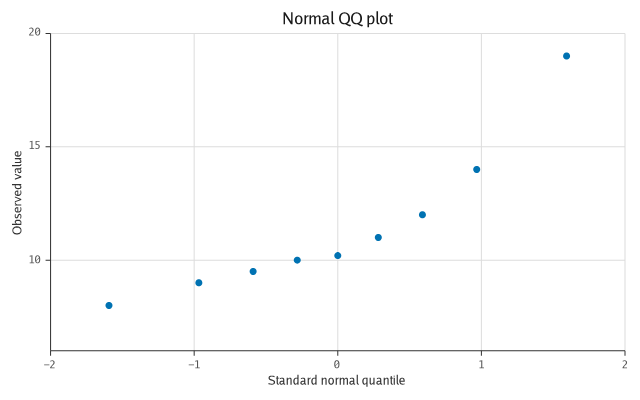 | 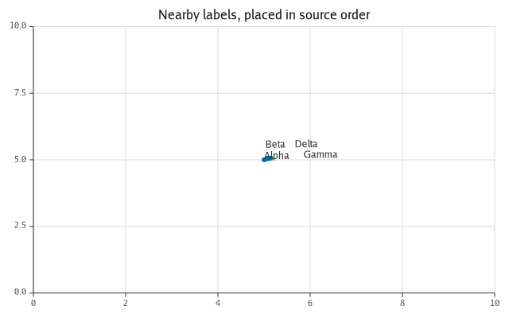 |

## A chart as JSON

```go
doc, err := p.MarshalJSON()      // indented; json.Marshal(p) compacts it
q, err := refract.ParseJSON(doc) // and reads back as the same chart
```

The document is Vega-Lite-*shaped*: `data.values`, `mark.type`,
`encoding.x.field`, `scale.type`, `facet` and `resolve` mean what they mean in
Vega-Lite, so anyone who knows that vocabulary can read one. It is not a
Vega-Lite subset and does not claim to be — refract has marks and options
Vega-Lite has no name for, and naming them plainly beats smuggling them through
a borrowed name. What is guaranteed is the round trip through refract, and there
is a test per mark and per scale that renders both and compares the primitives
([ADR 0014](docs/adr/0014-json-spec.md)).

```json
{
  "$schema": "https://github.com/timzifer/refract/spec/v1",
  "width": 640,
  "height": 400,
  "title": "Throughput",
  "data": {
    "values": [{"x": 0, "y": 2}],
    "format": {"parse": {"x": "number", "y": "number"}}
  },
  "encoding": {
    "x": {"type": "quantitative", "scale": {"type": "linear", "nice": true}},
    "y": {"type": "quantitative", "scale": {"type": "linear", "nice": true}}
  },
  "layer": [
    {
      "mark": {"type": "line", "color": "#0072b2"},
      "encoding": {"x": {"field": "x"}, "y": {"field": "y"}}
    }
  ],
  "config": {"theme": "light"}
}
```

(shown with the objects folded up; the real output puts every field on its own
line)

## Plotting Arrow data

```go
import "github.com/timzifer/refract/arrow/v18"

src := arrow.Source(rec)      // rec is an arrow.Record
p.Add(geom.Line(src, geom.X("t"), geom.Y("p99")))
```

A `float64` column with no nulls is Arrow's own buffer — no copy, no conversion.
Everything else (integers, `float32`, timestamps, dictionary-encoded strings)
converts once on first use and is cached, so a record with forty columns and a
chart that plots two pays for two. An Arrow null becomes `NaN`, which means the
missing-data policy you already set covers it
([ADR 0013](docs/adr/0013-arrow-adapter.md)).

## How it fits together

```
   Your spec  ──►  Model  ──►  IR  ──►  Backend  ──►  output
   ─────────      ─────      ────      ───────       ──────
   geoms          scales     ~8        backend/svg     SVG
   scales         coords     drawing   backend/pdf     PDF
   coords         layout     ops       backend/canvas  browser canvas
   theme          ticks                backend/gg      PNG / JPEG / a surface
   facets         panels               backend/window  a native window
```

The `ir.Backend` interface is the seam. Geoms never touch a renderer; a renderer
never knows what a scale is. That is what lets refract stand on a young,
fast-moving graphics stack without being welded to it — the whole gg adapter is
about 300 lines ([why that matters](docs/adr/0006-gg-coupling-surface.md)).

Things ride on that seam without widening it. A render can be *watched*, so that
a pointer can be told which layer drew what it is over
([ADR 0015](docs/adr/0015-hit-testing.md)); two frames can be *compared*, so that
a surface repaints only what moved
([ADR 0016](docs/adr/0016-streaming-and-damage.md)); and a backend that can carry
words, resize itself, or repaint part of a frame says so through an optional
interface — `ir.Semantics`, `ir.Resizer`, `ir.Partial` — rather than through a
method every backend would have to implement. No identity channel and no damage
channel went into the drawing interface.

The native window is the same argument once more: it is a surface that draws
with the raster backend and presents the result, so there is one implementation
of every mark and a window shows what a file would
([ADR 0021](docs/adr/0021-native-window.md)).


## Documentation

- [CONCEPT.md](CONCEPT.md) — the design document: motivation, positioning,
  architecture, roadmap.
- [docs/adr](docs/adr) — why the open questions were answered the way they were.
- [docs/v1-api-audit.md](docs/v1-api-audit.md) — every exported identifier
  with a verdict before the API freeze: freeze, change before v1, or defer.
- [docs/chart-types.md](docs/chart-types.md) — every chart form, what draws it
  today, and what the missing ones would cost.
- [docs/benchmarks.md](docs/benchmarks.md) — the benchmark suite: what each
  benchmark measures, which numbers are gated, and the latest results.
- [pkg.go.dev](https://pkg.go.dev/github.com/timzifer/refract) — the API
  reference, generated from the doc comments.
- [CONTRIBUTING.md](CONTRIBUTING.md) — building a five-module repository, how
  to regenerate golden files and figures, and how a release is tagged.
- [SECURITY.md](SECURITY.md) — which versions get fixes, and how to report a
  vulnerability privately.
- [CODE_OF_CONDUCT.md](CODE_OF_CONDUCT.md) — what participating here looks
  like.

## A note on how this was built

Much of refract was written with an AI assistant — Claude, in Claude Code — in
the loop, under human direction and review. The design decisions and the
arguments in the ADRs are the ones a human signed off on; a good deal of the
typing was not. What makes that workable is the same thing the rest of this
README describes: every claim here is held up by a golden file, a test or a
benchmark that CI runs on every commit, so the code is checked against the
behaviour rather than against a plausible-sounding explanation of it.

## License

MIT. The core links nothing; `backend/gg` links only permissively licensed code
(gg is MIT, `x/image` is BSD-3-Clause). That is a requirement rather than a
preference — refract must be embeddable by downstream projects under any
license.
