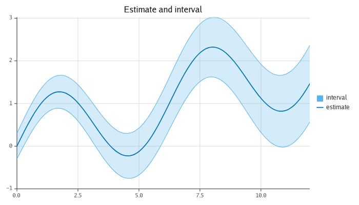
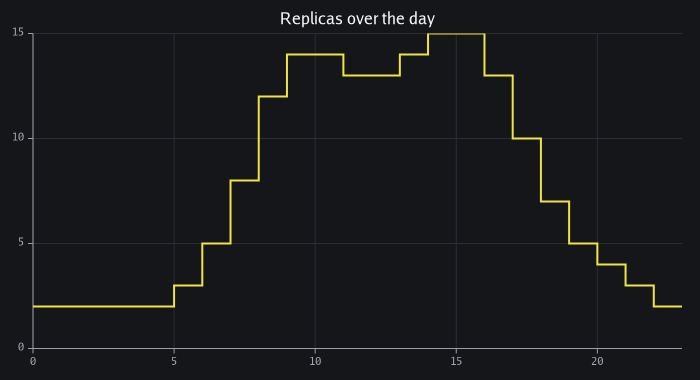
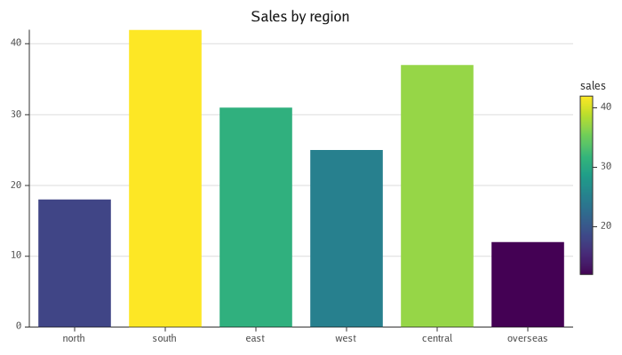
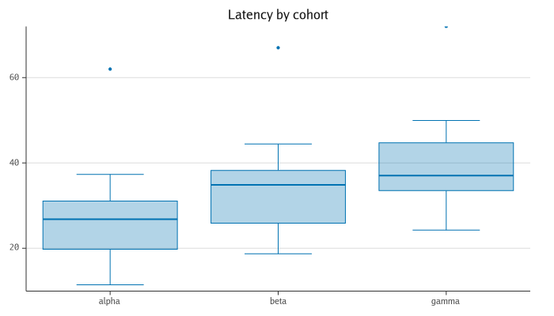
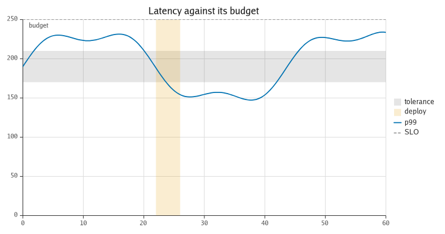
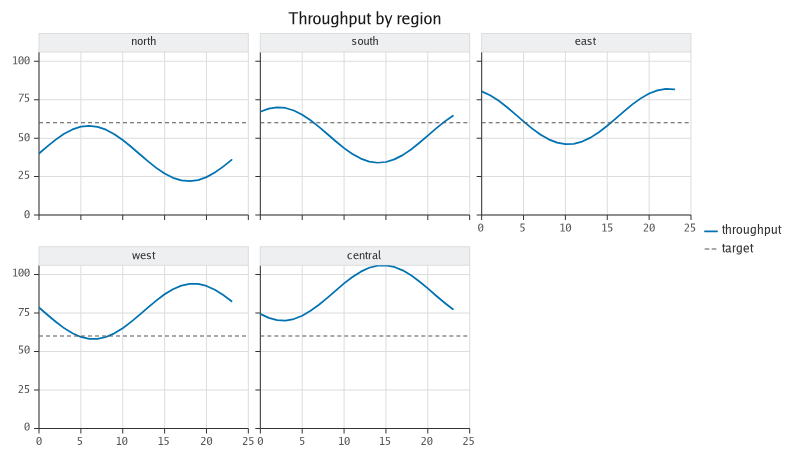
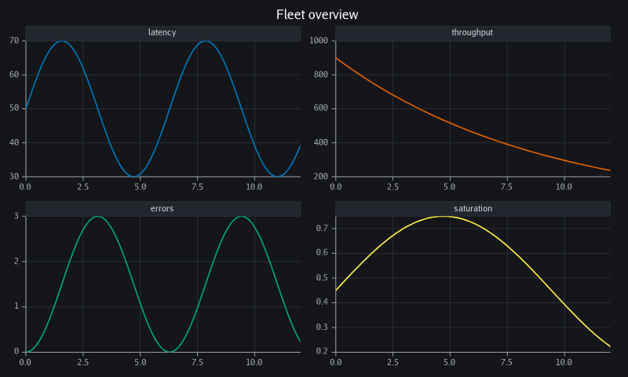
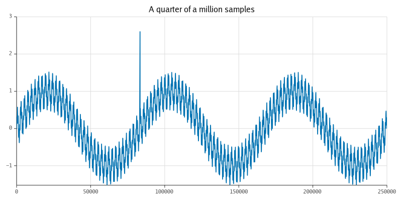
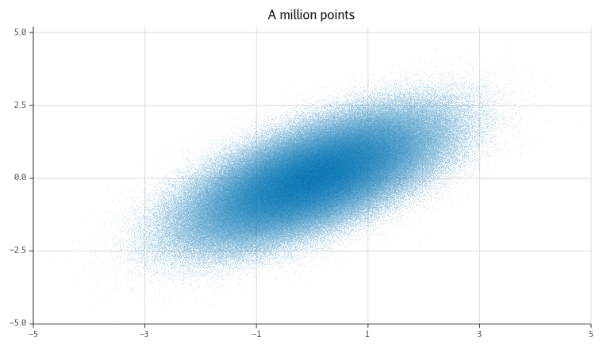

<p align="center">
  
</p>

# refract

[](https://github.com/timzifer/refract/actions/workflows/ci.yml)
[](https://github.com/timzifer/refract/actions/workflows/ci.yml)
[](https://pkg.go.dev/github.com/timzifer/refract)
[](LICENSE)

**A grammar-driven plotting library for Go: one model, many backends, runs
everywhere — built on the GoGPU stack.**

> **Status: pre-alpha.** This is milestone **v0.5**, "web and interactivity".
> The API is not
> stable; every release below `v1.0.0` may contain breaking changes without a
> deprecation cycle. See [CONCEPT.md](CONCEPT.md) for the design and the road
> ahead.

The name is the thesis: one beam enters a prism, a spectrum comes out. One chart
specification enters refract, a spectrum of output formats comes out.


---

## What it is

One declarative chart specification, rendered through interchangeable backends.
The core is **pure Go with no dependencies at all** — not "no cgo", literally
nothing outside the standard library — and emits both vector formats, SVG and
PDF. Add one module and the same specification renders to PNG and JPEG through
[`gogpu/gg`](https://github.com/gogpu/gg), still with `CGO_ENABLED=0`.

| | Dependencies | Output |
|---|---|---|
| `github.com/timzifer/refract` | **stdlib only** | SVG, PDF, browser canvas |
| `github.com/timzifer/refract/backend/gg` | GoGPU (`gg`), `x/image` — zero CGO | PNG, JPEG |
| `github.com/timzifer/refract/arrow` | `apache/arrow-go` — zero CGO | — (a data source) |

The browser is in the core too, because it needs nothing to be: a canvas 2D
context is reached through `syscall/js`, which is the standard library
([ADR 0017](docs/adr/0017-browser-backend.md)). Raster, GPU and native-window
rendering all live behind the same `ir.Backend` interface. The rest are
milestones, not architecture changes.

## Install

```sh
go get github.com/timzifer/refract               # core: SVG and PDF, stdlib only
go get github.com/timzifer/refract/backend/gg    # raster: PNG and JPEG
go get github.com/timzifer/refract/arrow         # optional: plot Arrow data
```

Go 1.25 or newer ([why](docs/adr/0005-go-version.md)).

## Quick start

```go
package main

import (
	"log"
	"math"

	"github.com/timzifer/refract"
	"github.com/timzifer/refract/geom"
	"github.com/timzifer/refract/palette"
	"github.com/timzifer/refract/scale"
	"github.com/timzifer/refract/theme"
)

func main() {
	xs := make([]float64, 200)
	ys := make([]float64, 200)
	for i := range xs {
		xs[i] = float64(i) / 20
		ys[i] = math.Sin(xs[i])
	}

	p := refract.New(
		refract.Theme(theme.Dark),
		refract.Size(800, 400),
		refract.Title("Signal"),
		refract.YTitle("amplitude"),
	)
	p.X(scale.Linear(scale.Nice()))
	p.Y(scale.Linear(scale.Nice()))
	p.Add(geom.Line(
		refract.Float64Columns(map[string][]float64{"x": xs, "y": ys}),
		geom.X("x"), geom.Y("y"),
		geom.Color(palette.Blue),
		geom.Tension(0.4),
	))

	if err := p.Render(refract.SVG("signal.svg")); err != nil {
		log.Fatal(err)
	}
}
```

For PDF or raster, swap the target — nothing else changes:

```go
err := p.Render(refract.PDF("signal.pdf"))          // still stdlib only

import ggbackend "github.com/timzifer/refract/backend/gg"
err := p.Render(ggbackend.PNG("signal.png"))
```

A runnable version is in [`examples/signal`](examples/signal).

## Gallery

Every figure below is rendered by
[`backend/gg/cmd/gallery`](backend/gg/cmd/gallery) and re-checked in CI, so a
picture here cannot drift away from the code that produced it.

| | |
|---|---|
|  |  |
|  |  |
|  |  |
|  |  |
|  |  |
|  |  |
|  |  |

## What it does

- **Scales** — linear, time, **log**, **symlog** and **ordinal/categorical**.
  Linear tick placement uses
  [extended Wilkinson](https://rdrr.io/rforge/labeling/man/extended.html)
  (Talbot, Lin & Hanrahan 2010), so axis labels come out round rather than
  merely evenly spaced. Time ticks step in calendar units. Log and symlog
  subdivide each decade with unlabelled minor ticks; symlog is linear near zero,
  so signed data spanning orders of magnitude is plottable at all.
- **Geoms** — `Line` (optionally tension-smoothed), `Scatter` (six marker
  shapes), `Bar`, **`Area`** (to a baseline, or a band between two series),
  **`Step`** (pre/mid/post), **`Boxplot`** (Tukey whiskers, type-7 quartiles,
  outliers).
- **Colour** — a qualitative palette per chart, plus **continuous colour
  scales**: `geom.ColorBy` maps a column through a sequential or diverging ramp.
  Ramps interpolate in linear light, so a gradient has no dark band through its
  middle.
- **Missing data** — one explicit policy per layer (gap, interpolate, error),
  covering both `NaN`/`Inf` and values a scale has no position for, such as zero
  on a log axis.
- **Annotations** — `HLine`, `VLine`, `HBand`, `VBand`, `Segment`, `Region` and
  `Note`. They take values rather than a data source, because there is no column
  behind "the SLO is 200ms", and they extend the axis so the threshold is in
  view even when the data is nowhere near it.
- **Small multiples and subplots** — `facet.Wrap` and `facet.Grid` split one
  plot by a column; `refract.NewGrid` puts different plots on one canvas. Both
  go through one constraint solver, so panels are the same size and their axes
  line up ([ADR 0010](docs/adr/0010-panel-layout.md)).
- **Chart furniture** — axes, grid, tick labels with collision avoidance, chart
  and axis titles, and a guide column carrying a legend and **colourbars**.
- **Themes** — light and dark, built from a dozen
  [tokens](theme/tokens.go) rather than fifty fields, with a colourblind-safe
  ([Okabe-Ito](https://jfly.uni-koeln.de/color/)) default palette and
  perceptually uniform sequential ramps (Viridis, Cividis, Magma). `Theme.With`
  edits one; `theme.Register` and `theme.ByName` resolve one from a config file.
- **Big data** — a layer with more rows than the plot has pixels reduces itself
  before it draws: `stat.LTTB` for a line, min/max per pixel column for a
  staircase or a band, density binning to an image for a point cloud. It happens
  when the chart is drawn, never when the scales are trained, so the axes still
  report the data rather than the subset that survived
  ([ADR 0011](docs/adr/0011-decimation.md)).
- **Parallel panels** — a facet or a grid builds its panels on separate
  goroutines and replays them in panel order, so the output is byte-identical to
  a serial render ([ADR 0012](docs/adr/0012-parallel-panels.md)).
- **Data** — columnar and batch-oriented, carrying numeric, time and categorical
  columns. A `[]float64`-backed source is borrowed, never copied, and so is a
  null-free `float64` column read straight out of an **Apache Arrow** record
  through the optional `refract/arrow` module.
- **Interaction** — `Plot.On` registers handlers for hover, click, zoom and
  pan; `Plot.Live` draws into a surface that can be redrawn; `Live.Bind` wires a
  DOM element to it. Hit-testing runs over the marks a render emitted rather
  than over a second copy of every geom's projection, and `Live.TrackRows`
  makes a hit name the source row behind the mark
  ([ADR 0015](docs/adr/0015-hit-testing.md)).
- **Live data** — `data.Stream` is appended to from any goroutine and frozen
  between frames, and a redraw repaints only what changed
  ([ADR 0016](docs/adr/0016-streaming-and-damage.md)).
- **A chart as JSON** — a `*Plot` marshals to a Vega-Lite-shaped document and
  reads back as the same chart ([ADR 0014](docs/adr/0014-json-spec.md)).
- **Backends** — three built-in emitters — SVG, PDF and a browser canvas — and
  the gg raster adapter.

Deliberately **not** here yet: the GPU tier and a native interactive window.
Both are v0.6 in [CONCEPT.md §14](CONCEPT.md#14-roadmap--milestones).

## Categories, distributions and orders of magnitude

```go
src := refract.NewTable().
    String("region", []string{"north", "south", "east", "west"}).
    Float64("sales", []float64{18, 42, 31, 25})

p := refract.New(refract.Size(700, 400), refract.Title("Sales by region"))
p.X(scale.Ordinal())                        // equal slots, one per category
p.Y(scale.Linear(scale.Nice(), scale.Zero()))
p.Add(geom.Bar(src,
    geom.X("region"), geom.Y("sales"),
    geom.ColorBy("sales", scale.Sequential(palette.Viridis)),
))
```

An ordinal axis is a *band* scale: it tells the bar how wide to be, rather than
the bar guessing from the spacing of the data. The same applies to
`geom.Boxplot`. For data that spans decades, swap in `scale.Log(scale.LogNice())`
— or `scale.SymLog()` when it also crosses zero.

A runnable version, together with a boxplot over the same kind of data, is in
[`examples/categories`](examples/categories).

## Small multiples

```go
p := refract.New(refract.Size(900, 520), refract.Title("Throughput by region"))
p.Add(
    geom.Line(src, geom.X("hour"), geom.Y("rps"), geom.Label("throughput")),
    geom.HLine(60, geom.Label("target")),          // no data: drawn on every panel
)
p.Facet(facet.Wrap("region", facet.Columns(3)))
```

Panels share their scales by default, which is what makes small multiples
comparable at a glance. `facet.FreeX`, `facet.FreeY` and `facet.Free` give each
panel its own — a deliberate choice, because a reader who does not notice the
axes changed will read the panels as comparable when they are not.

For unrelated charts on one canvas, build a grid of plots instead:

```go
g := refract.NewGrid(2, refract.GridSize(900, 560), refract.GridTitle("Fleet"))
g.Add(latency, throughput, errors, saturation)
err := g.Render(refract.PDF("overview.pdf"))
```

A runnable version of both, with annotations and PDF output, is in
[`examples/dashboard`](examples/dashboard).

## A million rows

```go
p := refract.New(refract.Size(800, 500), refract.Title("A million samples"))
p.Add(geom.Line(src, geom.X("i"), geom.Y("v")))   // nothing else needed
```

That renders in about 60 ms into under 30 kB of SVG. Drawing every row takes six
times as long and produces 15 MB — of a picture that is 800 pixels wide, so the
extra 999,000 vertices land on top of each other.

The layer sees how many rows it has against how wide the plot is and reduces
itself accordingly: `LTTB` for a line, min/max per pixel column for a step or a
band, a density raster for a scatter dense enough that its markers would bury
one another. Override it per layer when the default is not what you want:

```go
geom.Line(src, geom.X("i"), geom.Y("v"), geom.Decimate(geom.MinMax))    // keep every spike
geom.Line(src, geom.X("i"), geom.Y("v"), geom.Decimate(geom.NoDecimation)) // every row
geom.Scatter(src, geom.X("x"), geom.Y("y"), geom.Budget(4000))          // at most 4000 marks
```

The reduction happens when the chart is drawn, not when its scales are trained,
so the axes are the data's either way — a spike survives the reduction *and* the
axis still reaches it.

The same milestone made a redrawn chart cheap: everything sized by the data comes
from a pool, so a steady-state frame over a million rows costs the same handful
of allocations as one over a thousand. There is a test that fails if that stops
being true.

A runnable version — two million samples with a spike and a dropout in them, and
a million-point cloud — is in [`examples/bigdata`](examples/bigdata).

## Interactive, in a browser

The same model that renders SVG on a server draws on a `<canvas>`, with the
pointer reporting what it is over:

```go
//go:build js && wasm

p.On(refract.Hover, func(ev refract.Event) {
	if ev.Found {
		readout.Set("textContent", fmt.Sprintf("%s: %.2f, %.2f", ev.Series(), ev.Hit.X, ev.Hit.Y))
	}
})

live, err := p.Live(canvas.Element(el))   // a surface, redrawn
defer live.Close()
live.Draw()
defer live.Bind(el)()                     // pointer, wheel zoom, drag pan, double-click reset
```

Hit-testing works over the marks the render actually emitted, so it is right for
every geom — including a decimated one, where the rows you can point at are
exactly the rows on screen ([ADR 0015](docs/adr/0015-hit-testing.md)). Zoom and
pan are arithmetic on the scales, so the value under the pointer stays under the
pointer on a log or a time axis as much as on a linear one.

Turn on row identity when a hit has to name a row rather than describe a point —
highlighting the matching row of a table beside the chart is the case:

```go
live.TrackRows(true)

p.On(refract.Hover, func(ev refract.Event) {
	if ev.Found && ev.Hit.Row >= 0 {
		highlightTableRow(ev.Hit.Row)   // a row of the table you handed in
	}
})
```

It is off by default and costs a position and a row number per mark; it does not
cost per-frame allocations, and CI pins that. Decimation is not in the way —
LTTB and min/max keep *real* rows — and neither is faceting, whose per-panel
cuts are resolved back to the table you passed. A mark that no single row is
behind — a boxplot's box, a density raster, an interpolated point across a
gap — reports `-1` rather than a plausible neighbour.

A runnable version is in [`examples/web`](examples/web):

```sh
GOOS=js GOARCH=wasm go build -o examples/web/chart.wasm ./examples/web
cp "$(go env GOROOT)/lib/wasm/wasm_exec.js" examples/web/
```

## Live data

A `data.Stream` is appended to from one goroutine and frozen for the renderer on
another. It is deliberately not a `Source`: a table being appended to between
two column reads is a table that disagrees with itself.

```go
st := data.NewStream("t", "y").Window(2000)
p.Add(geom.Line(st.Source(), geom.X("t"), geom.Y("y")))

go func() {
	for s := range samples {
		st.Append(scale.Nanos(s.At), s.Value)   // any goroutine, any time
	}
}()

for range ticker.C {
	st.Snapshot()   // freeze what has arrived
	live.Draw()     // draw the frozen view
}
```

Each `Draw` compares the frame with the last one and repaints only where they
differ; a frame identical to the last is not painted at all. A backend says it
can do that by implementing `ir.Partial`, and one that cannot gets the whole
frame as before ([ADR 0016](docs/adr/0016-streaming-and-damage.md)). Appending a
row and freezing a view both allocate nothing in the steady state, and the
benchmark gate keeps it that way.

See [`examples/stream`](examples/stream).

## A chart as JSON

```go
doc, err := p.MarshalJSON()      // indented; json.Marshal(p) compacts it
q, err := refract.ParseJSON(doc) // and reads back as the same chart
```

The document is Vega-Lite-*shaped*: `data.values`, `mark.type`,
`encoding.x.field`, `scale.type`, `facet` and `resolve` mean what they mean in
Vega-Lite, so anyone who knows that vocabulary can read one. It is not a
Vega-Lite subset and does not claim to be — refract has marks and options
Vega-Lite has no name for, and naming them plainly beats smuggling them through
a borrowed name. What is guaranteed is the round trip through refract, and there
is a test per mark and per scale that renders both and compares the primitives
([ADR 0014](docs/adr/0014-json-spec.md)).

```json
{
  "$schema": "https://github.com/timzifer/refract/spec/v0.5",
  "width": 640,
  "height": 400,
  "title": "Throughput",
  "data": {
    "values": [{"x": 0, "y": 2}],
    "format": {"parse": {"x": "number", "y": "number"}}
  },
  "encoding": {
    "x": {"type": "quantitative", "scale": {"type": "linear", "nice": true}},
    "y": {"type": "quantitative", "scale": {"type": "linear", "nice": true}}
  },
  "layer": [
    {
      "mark": {"type": "line", "color": "#0072b2"},
      "encoding": {"x": {"field": "x"}, "y": {"field": "y"}}
    }
  ],
  "config": {"theme": "light"}
}
```

(shown with the objects folded up; the real output puts every field on its own
line)

## Plotting Arrow data

```go
import "github.com/timzifer/refract/arrow"

src := arrow.Source(rec)      // rec is an arrow.Record
p.Add(geom.Line(src, geom.X("t"), geom.Y("p99")))
```

A `float64` column with no nulls is Arrow's own buffer — no copy, no conversion.
Everything else (integers, `float32`, timestamps, dictionary-encoded strings)
converts once on first use and is cached, so a record with forty columns and a
chart that plots two pays for two. An Arrow null becomes `NaN`, which means the
missing-data policy you already set covers it
([ADR 0013](docs/adr/0013-arrow-adapter.md)).

## How it fits together

```
   Your spec  ──►  Model  ──►  IR  ──►  Backend  ──►  output
   ─────────      ─────      ────      ───────       ──────
   geoms          scales     ~8        backend/svg     SVG
   scales         layout     drawing   backend/pdf     PDF
   theme          ticks      ops       backend/canvas  browser canvas
   facets         panels               backend/gg      PNG / JPEG
                                       (future)        GPU, native window
```

The `ir.Backend` interface is the seam. Geoms never touch a renderer; a renderer
never knows what a scale is. That is what lets refract stand on a young,
fast-moving graphics stack without being welded to it — the whole gg adapter is
about 300 lines ([why that matters](docs/adr/0006-gg-coupling-surface.md)).

Two things ride on that seam without widening it. A render can be *watched*, so
that a pointer can be told which layer drew what it is over
([ADR 0015](docs/adr/0015-hit-testing.md)); and two frames can be *compared*, so
that a surface repaints only what moved
([ADR 0016](docs/adr/0016-streaming-and-damage.md)). Neither put an identity
channel or a damage channel into the drawing interface every backend
implements.


## Documentation

- [CONCEPT.md](CONCEPT.md) — the design document: motivation, positioning,
  architecture, roadmap.
- [docs/adr](docs/adr) — why the open questions were answered the way they were.
- [CONTRIBUTING.md](CONTRIBUTING.md) — building a three-module repository, and
  how to regenerate golden files and figures.

## License

MIT. The core links nothing; `backend/gg` links only permissively licensed code
(gg is MIT, `x/image` is BSD-3-Clause). That is a requirement rather than a
preference — refract must be embeddable by downstream projects under any
license.
